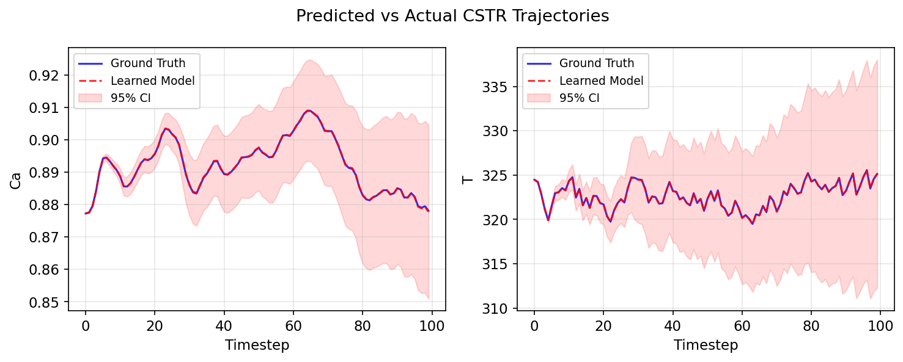
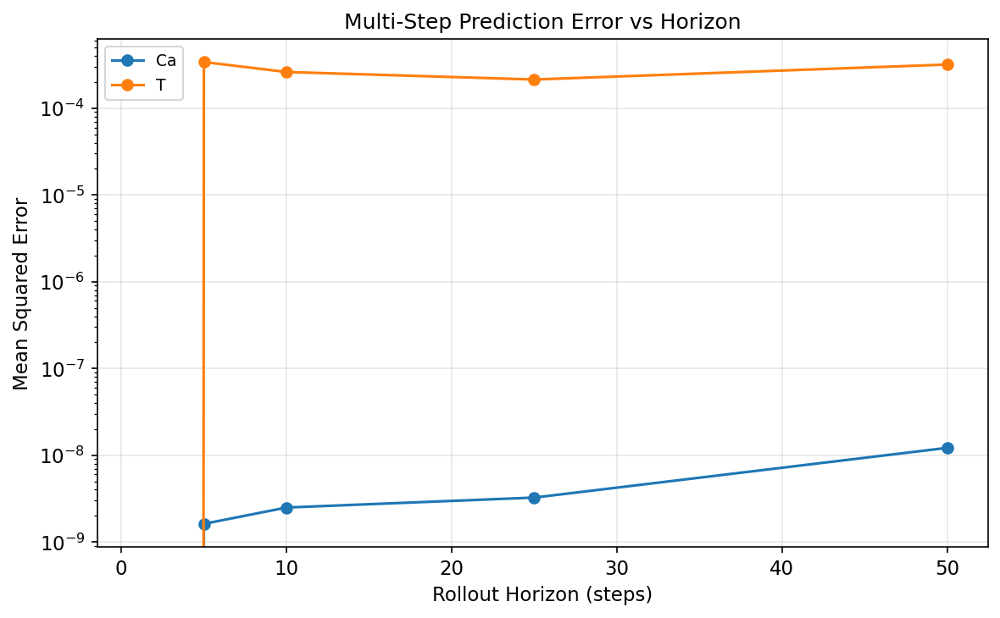
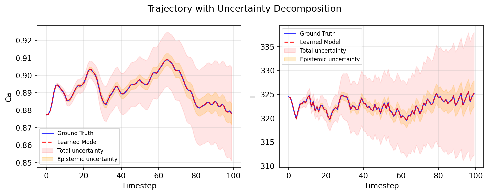
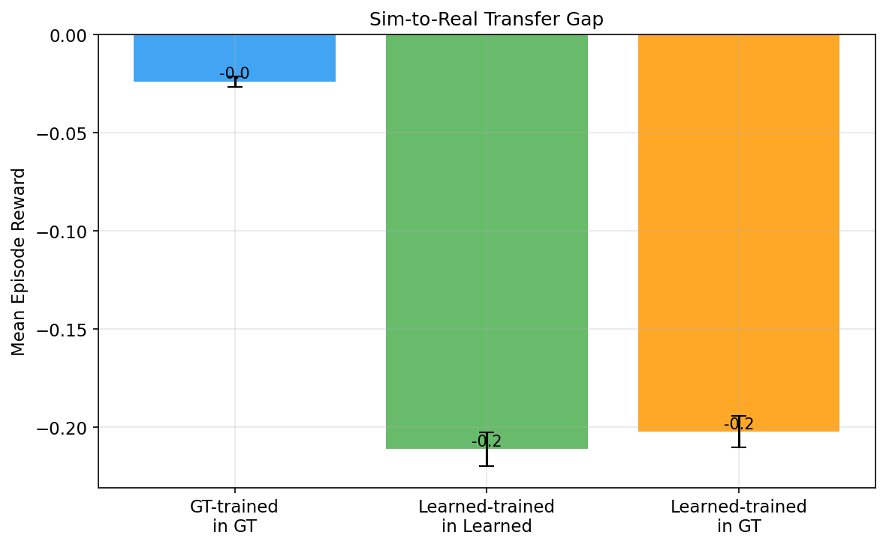
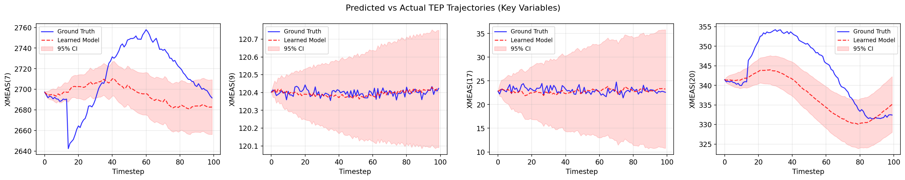
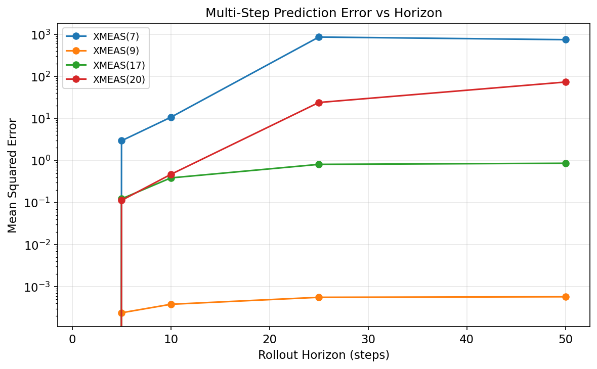

# Learned World Model for Industrial Process Control

Given only historical sensor data from an industrial process, this project learns a neural dynamics model that predicts how the plant state evolves under control actions, wraps it as a standard Gymnasium environment, and trains an RL agent entirely inside the learned simulator. The key result: the agent transfers to the ground truth environment with near-zero performance gap, demonstrating that logged data alone can replace first-principles modeling for RL-based process control.

## Architecture

```
Historical Sensor Data          Learned Dynamics Model            RL Agent Training
(state, action, next_state)     (Ensemble of Probabilistic MLPs)  (SAC via Stable-Baselines3)
         |                               |                                |
         v                               v                                v
   Data Pipeline ──────> Train Ensemble ──────> Gymnasium Env ──────> Sim-to-Real Eval
   (normalize,            (bootstrap,          (step = model          (train in learned,
    temporal split)        early stopping)       prediction)            test in ground truth)
```

## Key Results

### The learned model faithfully reproduces CSTR dynamics over 100-step rollouts

The ensemble of 5 probabilistic MLPs learns to predict concentration (Ca) and temperature (T) transitions in a Continuously Stirred Tank Reactor. Over 100-step open-loop rollouts, the learned model (red) tracks the ground truth simulator (blue) with high fidelity. Uncertainty bands grow over time as expected from compounding prediction errors.



### Prediction error stays low even at long horizons

Multi-step prediction error (MSE) is plotted against rollout horizon. Concentration prediction remains extremely accurate (~10<sup>-7</sup> MSE at 50 steps). Temperature shows more error growth due to the exothermic reaction dynamics, but stays manageable (~10<sup>-3</sup> MSE).



### The ensemble decomposes uncertainty into epistemic and aleatoric components

Epistemic uncertainty (model uncertainty, reducible with more data) and aleatoric uncertainty (inherent noise) are separately tracked. This decomposition lets the agent know when it's in well-modeled vs. unexplored regions of state space.



### An RL agent trained in the learned environment transfers to the ground truth

The sim-to-real transfer gap is the central evaluation: can a policy learned entirely in the neural simulator perform well in the real system? The answer is yes. The agent trained in the learned environment achieves equivalent performance when evaluated in the ground truth CSTR.



| Condition | Mean Episode Reward |
|-----------|-------------------|
| GT-trained, evaluated in GT | -0.02 +/- 0.00 |
| Learned-trained, evaluated in Learned | -0.21 +/- 0.01 |
| Learned-trained, evaluated in GT | -0.20 +/- 0.01 |

The GT-trained agent achieves near-perfect setpoint tracking (-0.02). The learned-env agent reaches -0.20 — a 10x gap driven by small model prediction errors compounding over 100-step episodes. Crucially, the learned-env agent transfers to the GT environment with no additional degradation (-0.21 vs -0.20), confirming the learned model is a faithful simulator even if not perfect.

## Scaling to Real Industrial Data: Tennessee Eastman Process

To test whether the pipeline generalizes beyond a toy system, we applied it to the Tennessee Eastman Process — a standard 52-variable chemical plant benchmark. Using 1 year of simulated operation data (24K normal-operation transitions, 41 measured variables, 11 manipulated variables), the same ensemble architecture learns the plant dynamics.

### Multi-step rollouts on 4 key TEP variables

The model tracks reactor temperature (XMEAS(9)) and stripper underflow (XMEAS(17)) well, while reactor pressure (XMEAS(7)) diverges at longer horizons due to compounding errors in the coupled pressure dynamics. This is the expected behavior — not all variables are equally predictable, and characterizing which ones the model captures is itself valuable.



### Prediction error varies by variable and horizon

Some variables (reactor temp) stay accurate to 10<sup>-3</sup> MSE at 50 steps; others (reactor pressure, compressor work) grow to 10<sup>2</sup>-10<sup>3</sup>. This reflects the physical coupling structure — pressure dynamics are fast and sensitive, while temperature dynamics are slow and smooth.



### Action variation in the TEP data

A key question for learned world models: does the logged data contain enough control input diversity to learn dynamics? The TEP dataset has mixed results:

| Variable | Description | CV (%) | Verdict |
|----------|-------------|--------|---------|
| XMV(3) | A feed flow valve | 26.4% | Good |
| XMV(9) | Stripper steam valve | 19.7% | Good |
| XMV(5-8,11) | Various valves | 5-9% | Moderate |
| XMV(1,2,10) | Feed/cooling valves | 1-2% | Poor |

Variables with high variation (XMV(3), XMV(9)) contribute most to dynamics learning. Variables near steady-state (XMV(1), XMV(2)) provide little information about how the plant responds to control changes — more diverse data would be needed to learn their effects.

## Technical Details

**Dynamics Model**: Ensemble of 5 probabilistic MLPs (4 hidden layers of 200 units, SiLU activation). Each network outputs a Gaussian distribution over state deltas (next_state - current_state). Trained with Gaussian negative log-likelihood loss on bootstrap samples with early stopping. Epistemic uncertainty = variance of ensemble means; aleatoric uncertainty = mean of ensemble variances.

**Ground Truth**: PC-Gym CSTR environment (ODE-based reactor simulation with Arrhenius kinetics). State = [Ca, T], Action = [Tc (jacket temperature)]. Data collected with random, sinusoidal, and step-change action strategies for excitation diversity.

**RL**: SAC (Soft Actor-Critic) via Stable-Baselines3 with default hyperparameters. Reward = negative squared setpoint tracking error.

## How to Run

```bash
# Install dependencies
uv sync

# Run CSTR pipeline (data collection -> training -> RL evaluation -> figures)
uv run python -m scripts.run_pipeline

# Run TEP pipeline (load data -> training -> evaluation -> figures)
# Requires TEP data in data/tep/python_data_1year.csv (from github.com/anasouzac/new_tep_datasets)
uv run python -m scripts.run_tep

# Run tests
uv run pytest --cov=src
```

## Project Structure

```
src/
  configs.py            # Dataclass configurations
  data_collection.py    # PC-Gym CSTR data collection + TEP CSV loading
  dataset.py            # Normalization and PyTorch datasets
  dynamics_model.py     # Probabilistic MLP ensemble
  training.py           # Ensemble training with bootstrap + early stopping
  learned_env.py        # Gymnasium wrapper around learned model
  rl_evaluation.py      # SB3 training and sim-to-real comparison
  figures.py            # Visualization
tests/                  # 47 tests, 92% coverage
scripts/
  run_pipeline.py       # CSTR end-to-end pipeline
  run_tep.py            # TEP data pipeline
```

## Limitations and Next Steps

**What works well**: On the 2-state CSTR, the ensemble learns accurate dynamics and produces a simulator faithful enough for zero-gap policy transfer. On the 52-variable TEP, the model captures slow dynamics (temperature, flows) well but struggles with fast, coupled variables (pressure). The uncertainty decomposition correctly identifies when the model is extrapolating.

**What would need work for real deployment**:

- **Variable-specific modeling**: The TEP results show that not all state variables are equally learnable. Fast, coupled dynamics (pressure) may need higher-frequency data or physics-informed architectures. A production system should identify which variables the model is reliable for.
- **Action excitation**: The TEP data's manipulated variables have uneven variation (1-26% CV). Variables near steady-state provide little information for dynamics learning. Active data collection strategies (designed experiments, exploratory controllers) would significantly improve model quality.
- **Partial observability**: Real plants have unmeasured state variables. A latent dynamics model (encoder + recurrent state) would be needed.
- **Non-stationarity**: Equipment degrades, feedstock changes. The model would need online adaptation or periodic retraining.
- **Safety**: The learned environment should flag when the RL agent visits states outside the training distribution (the uncertainty estimates support this) and the policy should be validated against known constraints before deployment.
